# Custom Suffix Output Target for Stencil

> Safely run multiple versions of the same Stencil component library in a **microfrontend** architecture by automatically suffixing component tag names validated at runtime.

[](https://www.npmjs.com/package/stencil-custom-suffix-output-target)  
[](LICENSE)
---

## 📖 Table of Contents
- [❓ Why](#-why)
- [🏗 Microfrontend Scenario](#-microfrontend-scenario)
- [🔧 How It Works](#-how-it-works)
- [📝 Example](#-example)
- [📦 Installation](#-installation)
- [⚡ Configuring the Suffix](#-configuring-the-suffix)
- [🅰 Angular Wrapper Integration](#%F0%9F%85%B0-angular-wrapper-integration)
- [🔃 Updating Tag Names](#-updating-tag-names)
- [❗ Limitations](#-limitations)
- [❓ FAQ](#-faq)

---

## ❓ Why

In **microfrontend architectures**, multiple independently deployed applications may use their own versions of a shared component library.  

Problem:  
- Web components are **global**. The first `customElements.define('my-button')` call locks that tag name.  
- Another microfrontend trying to use the same component library with a different version will lead to problems.  
- This leads to **version conflicts, unexpected behavior, and debugging nightmares**.  

✅ **Solution:** This output target automatically appends a **custom suffix** to all Stencil component tag names at build time. Each app can configure its own suffix, ensuring safe coexistence of multiple versions of the same component system.

---

## 🏗 Microfrontend Scenario

```mermaid
flowchart TD
    %% Libraries
    L1["Library v1.0<br>🔵 Blue Button"] --> A["App 1 (App A)<br>Library v1.0<br>🔵 Blue Button"]
    L2["Library v2.3<br>🟢 Green Button"] --> B["App 2 (App B)<br>Library v2.3<br>🟢 Green Button"]
    A --> Shared["Shared Microfrontend Environment"]
    B --> Shared["Shared Microfrontend Environment"]

    %% First action: Checkout
    Shared --> loadApp1["Load App 1 page<br>🔵 Button v1.0"]

    %% Second action: Admin
    loadApp1 --> clickApp2["Navigate to App 2<br>🔵 Button v1.0"]

    %% Third action: Admin
    clickApp2 --> refreshApp2["Refresh App 2<br>🟢 Button v2.3"]

    %% Fourth action: Checkout
    refreshApp2 --> revisitApp1["Navigate to App 1<br>🟢 Button v2.3"]

    %% Apply colors
    style L1 fill:#0052cc
    style L2 fill:#1e7e34 
```

<details>
<summary>📊 Show Mermaid Diagram</summary>
    


</details>

- **Without suffixing:** both apps try to register `<my-button>` → 💥 conflict.  
- **With suffixing:** App A gets `<my-button-checkout>`, App B gets `<my-button-admin>` → ✅ no conflicts, both versions coexist.

---

## 🔧 How It Works

During build, the output target:

- Reads the generated JS files in the Stencil `dist` folder (from `dist-custom-elements`).
- Applies a TypeScript AST + PostCSS transformation:
  - `h('my-tag') → h('my-tag' + suffix)`
  - `customElements.get/define('my-tag') → 'my-tag' + suffix`
  - `querySelector('my-tag') → querySelector('my-tag' + suffix)`
  - Inline CSS selectors updated (`my-tag {}` → `my-tag${suffix} {}`)
  - String comparisons like `elem.tagName === 'MY-TAG'` updated
- Injects a `custom-suffix.json` file into `dist`, read at runtime.

---

## 📝 Example

<details>
<summary>Before transformation</summary>

```ts
customElements.define('my-button', MyButton);
document.querySelector('my-button');
h('my-button');
const myCSS = `
  my-button {
    /* styles */
  }
`;
```
</details>

<details>
<summary>After transformation</summary>

```ts
import suffix from "../custom-suffix.json";

customElements.define('my-button' + suffix, MyButton);
document.querySelector(`my-button${suffix}`);
h('my-button' + suffix);
const myCSS = `
  my-button${suffix} {
    /* styles */
  }
`;
```
</details>

<details>
<summary>At runtime (if suffix = "-checkout")</summary>

```ts
customElements.define('my-button-checkout', MyButton);
document.querySelector('my-button-checkout');
h('my-button-checkout');
const myCSS = `
  my-button-checkout {
    /* styles */
  }
`;
```
</details>

---

## 📦 Installation

Install as a dependency (If you're not relying on the `set-custom-suffix` script, or have the package installed in your consuming project, you can install it as a dev dependency in your library):

```bash
npm install custom-suffix-output-target
```

Add it to your **stencil.config.ts**:

```ts
import { Config } from '@stencil/core';
import { customSuffixOutputTarget } from './scripts/custom-suffix-output-target';

export const config: Config = {
  extras: {
    // Enable tag name transformation (required)
    tagNameTransform: true,
  },
  outputTargets: [
    { type: 'dist-custom-elements' },
    customSuffixOutputTarget(),
  ],
};
```

---

## ⚡ Configuring the Suffix

Each consuming project must provide its own suffix.  

This is done by writing a `custom-suffix.json` file to the library’s `dist/components` folder at build/deploy time.

Example (`dist/custom-suffix.json`):
```json
"-your-suffix"
```

This package provides a simple script that automates this that can be added to your project's `package.json` (requires `stencil-custom-suffix-output-target` to be installed as a dependency in your library, or as a dev dependency in your consuming project):

```bash
"postinstall": "set-custom-suffix --set your-suffix --target @your-org/your-library"
```
---

## 🅰 Angular Wrapper Integration

This plugin was designed with the official [`angularOutputTarget`](https://stenciljs.com/docs/angular) in mind. For the angular wrapper to work with custom suffixes, a manual patch of the different generated files must be done. 

By adding another argument to the `set-custom-suffix` script, this patching can be automated:

```bash
"postinstall": "set-custom-suffix --set your-suffix --target @your-org/your-library --angular @your-org/your-angular-wrapper"
```

This will patch the following files in the angular wrapper project:
- `./fesm5.js`
- `./fesm2015.js`
- `./directives/proxies.d.ts`

These files are generated by the `angular-output-target` in your Stencil library, and is now patched to use the same suffix as the web components. Angular requires static tag names at build time, and cannot resolve them at runtime like web components can, at least as far as I've been able to determine, so a manual patch is necessary.

---

## 🔃 Updating Tag Names

After configuring the suffix (and running the angular patch if applicable), you must update all places where the tag names from the component library are used in your consuming app. This includes test, html templates, and any `querySelector` calls. Any reference to the original tag names must be updated to include the suffix.

--- 

## ❗ Limitations

- Only transforms **`dist/components` output** (from `dist-custom-elements`).
- All packages need to be in the same node_modules tree.
- Requires consumer apps to manage and update `custom-suffix.json`.  
- Multiple apps must use **different suffixes** to avoid conflicts.
- Multiple versions of the same library in one app is not supported.
- Requres manual updating of all places where tag names from the component library are used in the consuming app (e.g. in Angular templates, or `querySelector` calls).

---

## ❓ FAQ

**Q: What happens if two apps use the same suffix?**  
Then you’re back to name collisions. Each app must choose a unique suffix.  

**Q: Does this affect performance?**  
No, the suffix is resolved at build time and read once at runtime.  

**Q: Can I use this without Angular?**  
Yes — it works with plain web components or other frameworks as long as you manage `custom-suffix.json` and consume the components from the `dist-custom-elements` output target (in the `dist/components` folder).

**Q: What if I forget to set a suffix?**  
If no suffix is set, the default tag names will be used, which may cause conflicts if multiple versions are loaded together, but it will not break the build as long as the tag names in your source corresponds with the suffix.

---
