# Custom Suffix Output Target for Stencil

[](https://www.npmjs.com/package/stencil-custom-suffix-output-target)  
[](LICENSE)

> Safely run multiple versions of the same Stencil component library in a **microfrontend** architecture by automatically suffixing component tag names at build time.

---

## 📖 Table of Contents
- [❓ Why](#-why)
- [🏗 Microfrontend Scenario](#-microfrontend-scenario)
- [⚙️ How It Works](#%EF%B8%8F-how-it-works)
- [📝 Example](#-example)
- [📦 Installation](#-installation)
- [⚡ Configuring the Suffix](#-configuring-the-suffix)
- [🅰 Angular Wrapper Integration](#%F0%9F%85%B0-angular-wrapper-integration)
- [⚠️ Limitations](%EF%B8%8F-limitations)
- [❓ FAQ](#-faq)

---

## ❓ Why

In **microfrontend architectures**, multiple independently deployed applications may use their own versions of a shared component library.  

Problem:  
- Web components are **global**. The first `customElements.define('my-button')` call locks that tag name.  
- Another microfrontend trying to use the same component library with a different version will lead to problems.  
- This leads to **version conflicts, unexpected behavior, and debugging nightmares**.  

✅ **Solution:** This output target automatically appends a **custom suffix** to all Stencil component tag names at build time. Each app can configure its own suffix, ensuring safe coexistence of multiple versions of the same component system.

---

## 🏗 Microfrontend Scenario

```mermaid
flowchart TD
    %% Libraries
    L1["Library v1.0<br>🔵 Blue Button"] --> A["App 1 (App A)<br>Library v1.0<br>🔵 Blue Button"]
    L2["Library v2.3<br>🟢 Green Button"] --> B["App 2 (App B)<br>Library v2.3<br>🟢 Green Button"]
    A --> Shared["Shared Microfrontend Environment"]
    B --> Shared["Shared Microfrontend Environment"]

    %% First action: Checkout
    Shared --> loadApp1["Load App 1 page<br>🔵 Button v1.0"]

    %% Second action: Admin
    loadApp1 --> clickApp2["Navigate to App 2<br>🔵 Button v1.0"]

    %% Third action: Admin
    clickApp2 --> refreshApp2["Refresh App 2<br>🟢 Button v2.3"]

    %% Fourth action: Checkout
    refreshApp2 --> revisitApp1["Navigate to App 1<br>🟢 Button v2.3"]

    %% Apply colors
    style L1 fill:#0052cc
    style L2 fill:#1e7e34 
```

<details>
<summary>📊 Show Mermaid Diagram</summary>
    


</details>

- **Without suffixing:** both apps try to register `<my-button>` → 💥 conflict.  
- **With suffixing:** App A gets `<my-button-checkout>`, App B gets `<my-button-admin>` → ✅ no conflicts, both versions coexist.

---

## ⚙️ How It Works

During build, the output target:

- Reads the generated JS files in the Stencil `dist` folder (from `dist-custom-elements`).
- Applies a TypeScript AST + PostCSS transformation:
  - `h('my-tag') → h('my-tag' + suffix)`
  - `customElements.get/define('my-tag') → 'my-tag' + suffix`
  - `querySelector('my-tag') → querySelector('my-tag' + suffix)`
  - Inline CSS selectors updated (`my-tag {}` → `my-tag${suffix} {}`)
  - String comparisons like `elem.tagName === 'MY-TAG'` updated
- Injects a `custom-suffix.json` file into `dist`, read at runtime.

---

## 📝 Example

<details>
<summary>Before transformation</summary>

```ts
customElements.define('my-button', MyButton);
document.querySelector('my-button');
h('my-button');
const myCSS = `
  my-button {
    /* styles */
  }
`;
```
</details>

<details>
<summary>After transformation</summary>

```ts
import suffix from "../custom-suffix.json";

customElements.define('my-button' + suffix, MyButton);
document.querySelector(`my-button${suffix}`);
h('my-button' + suffix);
const myCSS = `
  my-button${suffix} {
    /* styles */
  }
`;
```
</details>

<details>
<summary>At runtime (if suffix = "-checkout")</summary>

```ts
customElements.define('my-button-checkout', MyButton);
document.querySelector('my-button-checkout');
h('my-button-checkout');
const myCSS = `
  my-button-checkout {
    /* styles */
  }
`;
```
</details>

---

## 📦 Installation

Install as a dev dependency:

```bash
npm install -D custom-suffix-output-target
```

Add it to your **stencil.config.ts**:

```ts
import { Config } from '@stencil/core';
import { customSuffixOutputTarget } from './scripts/custom-suffix-output-target';

export const config: Config = {
  extras: {
    // Enable tag name transformation (required)
    tagNameTransform: true,
  },
  outputTargets: [
    { type: 'dist-custom-elements' },
    customSuffixOutputTarget(),
  ],
};
```

---

## ⚡ Configuring the Suffix

Each consuming project must provide its own suffix.  

This is done by writing a `custom-suffix.json` file to the library’s `dist/components` folder at build/deploy time.

Example (`dist/custom-suffix.json`):
```json
"-checkout"
```

Practical setup for consumers:
```bash
echo '"-checkout"' > node_modules/your-lib/dist/custom-suffix.json
```
---

## 🅰 Angular Wrapper Integration

This plugin was designed with the official [`angularOutputTarget`](https://stenciljs.com/docs/angular) in mind. For the angular wrapper to work with custom suffixes, a manual patch of the different generated files, like `proxies.d.ts` and such must be done. 

I will upload our way of doing this soon

<!-- When used together:
- Angular wrapper components (e.g. `<my-button>`) will be suffixed automatically (`<my-button-checkout>`).
- Each Angular microfrontend can consume its own isolated version of the library.

Example in Angular app:

```html
<my-button-checkout label="Buy now"></my-button-checkout>
```
-->
---

## ⚠️ Limitations

- Only transforms **`dist/components` output** (from `dist-custom-elements`).  
- Requires consumer apps to manage and update `custom-suffix.json`.  
- Multiple apps must use **different suffixes** to avoid conflicts.  

---

## ❓ FAQ

**Q: Can I disable suffixing in dev mode?**  
Yes — set `extras.tagNameTransform = false` in `stencil.config.ts`.  

**Q: What happens if two apps use the same suffix?**  
Then you’re back to name collisions. Each app must choose a unique suffix.  

**Q: Does this affect performance?**  
No, the suffix is resolved at build time and read once at runtime.  

**Q: Can I use this without Angular?**  
Yes — it works with plain web components or other frameworks as long as you manage `custom-suffix.json` and consume the components from the `dist-custom-elements` output target (in the `dist/components` folder).

---
